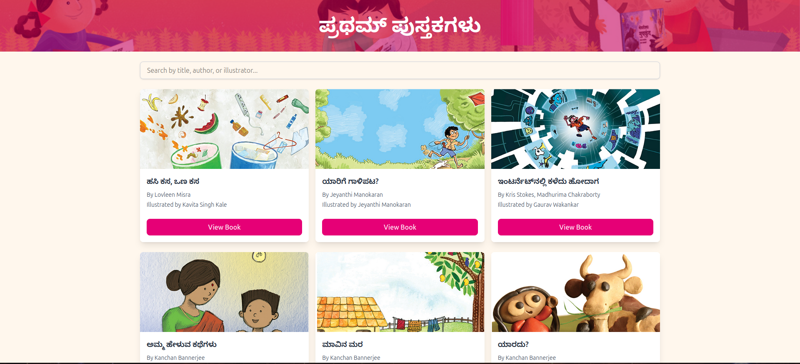
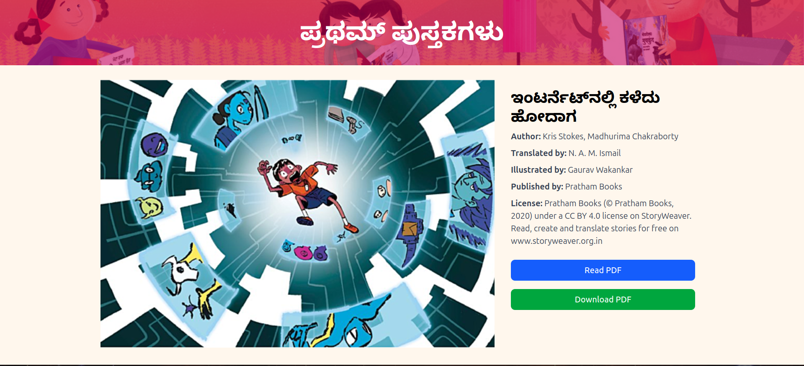

# Offline Storyweaver Reader

Storyweaver is a repository of illustrated books for children illustrated and published by Pratham Books. The Storyweaver repository contains over thousand Kannada books across various levels. These books are available online for free and is licensed under the Creative Commons. This repo is for a svelte-kit webapp that lets you view your downloaded books, search and view them on your local network. It is designed to be light weight, work on a raspberry pi and serve devices on your local network.





## Features 

1.  Scrapes metadata from the downloaded folder and adds it in the right format to books/metadata.yaml
2.  Drag and drop folders of books downloaded from <https://storyweaver.org.in/en/> to the books folder to view it in the webapp.
3.  Search by title, author, illustrator etc

## Upcoming features

1.  Categorise across levels, topics etc. A script that scrapes these information when there is internet for it to work offline.
2.  Dataset for the entire Kannada repository.

## License

This project builds upon Pratham Books Storyweaver's Creative Commons licensed content. Please respect the original licensing terms when using or redistributing this software.

## Developing

Once you've created a project and installed dependencies with `npm install` (or `pnpm install` or `yarn`), start a development server:

``` bash
npm run dev

# or start the server and open the app in a new browser tab
npm run dev -- --open
```

## Building

To create a production version of your app:

``` bash
npm run build
```

You can preview the production build with `npm run preview`.

> To deploy your app, you may need to install an [adapter](https://svelte.dev/docs/kit/adapters) for your target environment.